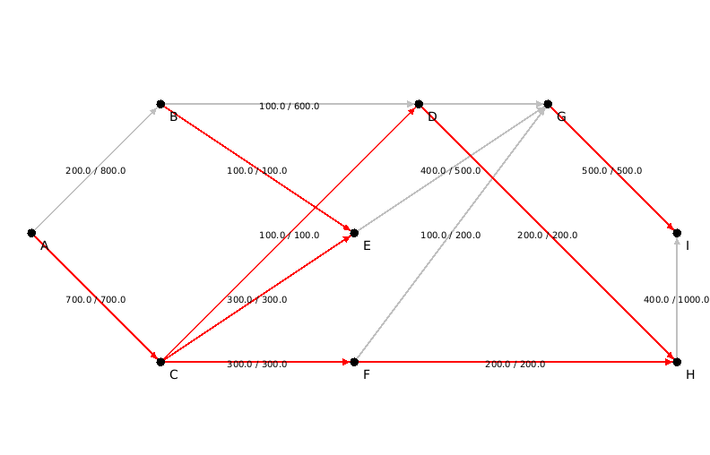
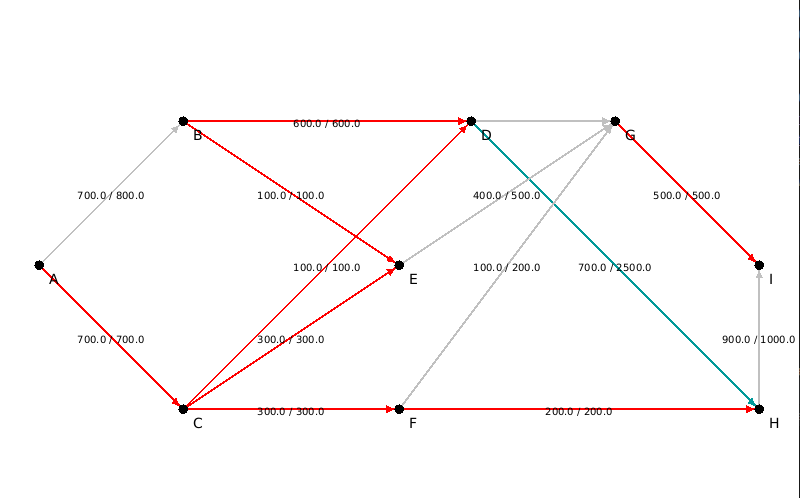
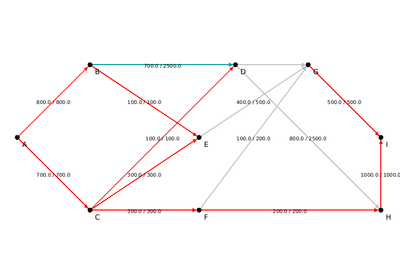

# flot Maximum  OUATAR Hakim

A.  Préambule :   
On récupère l'archive maxflow qui contient le code d'un algorithme de flot max et celui de test de cet algorithme .On doit résolver les problèmes liée à la version de GraphStream .   
On vérifie la solution obtenue et on le test sur second exemple .

B.  Construction de graphe associé au réseau routier et le mettre sous forme d'un fichier DGS :   

   >[Le fichier autoroute.dgs qui représente le graphe  ](./Data/autoroute.dgs)   
   

C.   Donnez la solution du problème de flot max en utilisant l'algorithme mis à votre disposition. Vous afficherez le réseau, les valeurs du flot sur les arêtes, et vous mettrez en évidence les arêtes saturées.   
      

D.  AVANT de tester toutes les solutions pour la question 2), que pouvez-vous déduire du flot
max sur le réseau routier concernant les tronçons à construire ?   

On vérifie les capacités sur les tronçons dans  graphe obtenu ,on peut déduire que le flot n'est pas optimal car on a des tronçons qui peuvent être augmenté en capacité.   
Ce flot maximal est à 900 à l'arrivée .Si on augmente les capacités de certains tronçons ,on aurait le flot max.  

E.  Donnez les flots successifs en justifiant qu'il s'agit bien à chaque fois du tronçon qui
augmente le plus la valeur courante du flot. Donnez les coupes minimum associées, et
commentez.    

Notre réseau est flot max de 900 pour augmenter ce flot ,on remarque que les flux arrivant à D par B ET C est faible à cause de manque de capacité de DH ,ce qui nons permettre de par rapport au autres tronçons  .   
Si on augmente la capacité de DH on  profitera de tout le flux qui arrive vers D et on arrive à H avec un flux total de 200 depuis F + 700 de D on aura 900 pour HI et avec DH on serait à 1400 arrivée à I.

     

On remarque que la capacité de AB n'est pas au max , si on ajoute les 100 voitures qui restes sur AB , on a le meilleur choix d'augmenter la capacité est BD qui profitera de la capacité de DH ,
on augmente BD .

   

